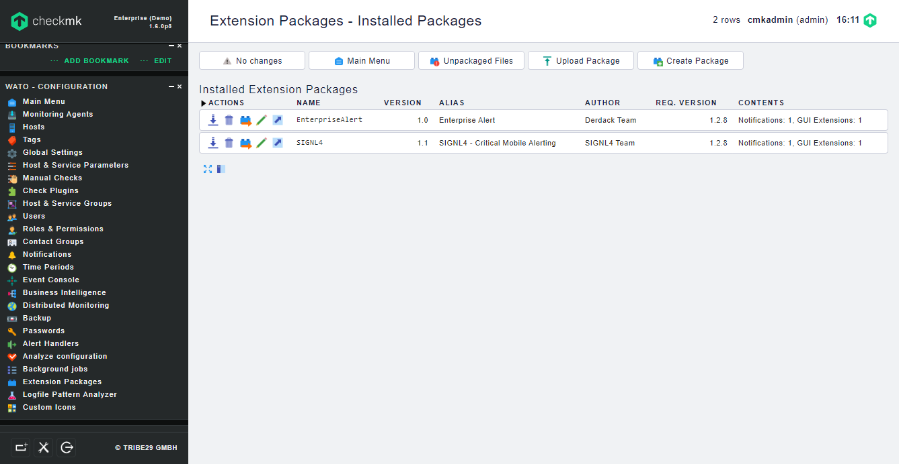

# Enterprise Alert Package for checkmk

## Why Enterprise Alert

Derdack’s enterprise alerting software automates alerting processes and enables a fast, reliable and effective response to incidents threatening the continuity of services and operations. This is in particular important for 24/7 operated mission-critical systems and IT.

Our critical alerting software combines four pillars to effectively respond to incidents – automated alert notifications, convenient duty scheduling, ad-hoc collaboration and anywhere incident remediation.

Find our more at https://www.derdack.com/enterprisealert-alerting-software/.

Pairing checkmk with Enterprise Alert can enhance your daily operations with an extension to your team wherever it is.

## Setup

In the following we describe the setup and configuration of the Enterprise Alert Package for checkmk:

1. Create a new REST API event source in Enterprise Alert.

2. Get the Enterprise Alert package (EnterpriseAlert-1.0.mkp) for checkmk from GitHub (https://github.com/derdack/derdack-integration-checkmk).

3. Upload the .mkp file in the checkmk portal under Extension Packages.

4. Create a Notification Rule and configure Enterprise Alert as Notification Method. You would need to set the REST API URL and your API Key. Also select one user in order to trigger the rule. Please note that the alert notification is sent as an event to Enterprise Alert. You can create an alert policy then according to your needs.

6. Now you can test it by simulating an alert in checkmk. When checkmk detects an issue, the information is forwarded as an event to Enterprise Alert where your alert policy can then trigger the alert.

You can find the package on GitHub:
https://github.com/derdack/derdack-integration-checkmk
